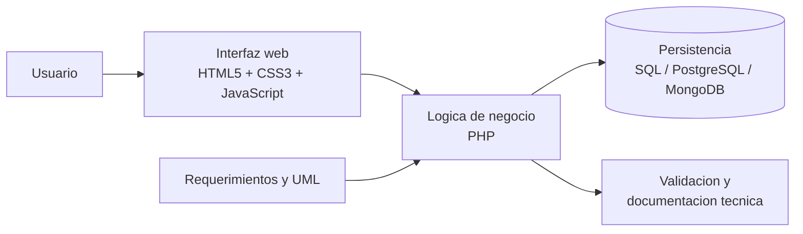

  

  
  &nbsp;&nbsp;
  
  &nbsp;&nbsp;
  
  &nbsp;&nbsp;

  

## Sobre mi

Estudiante de sexto semestre de Ingenieria de Sistemas, Tecnología en Analisis y Desarrollo de Sistemas de la Informacion. Me interesa construir soluciones web funcionales, mantenibles y orientadas a las necesidades reales de las personas.

Mi experiencia combina desarrollo web, bases de datos, levantamiento de requerimientos, modelado UML, diseno de interfaces, logica de negocio, validacion y documentacion tecnica.

- Me interesa seguir creciendo en desarrollo de software, arquitectura de sistemas, bases de datos e Inteligencia Artificial.
- Ubicacion: Villavicencio, Meta, Colombia.

## Experiencia

### Colpegasus | Practicas de desarrollo web

Durante cuatro meses participe en el desarrollo de una prueba vocacional RIASEC utilizando PHP, HTML, CSS y JavaScript.

- Diseno e implementacion de la interfaz y sus componentes de interaccion.
- Desarrollo de logica de negocio en PHP e integracion entre frontend y backend.
- Implementacion de validaciones para mejorar la consistencia de los datos.

## Stack tecnologico

  
  
  
  
  
  
  
  

## Arquitectura que manejo

Trabajo con una arquitectura web por capas, separando la experiencia de usuario, la logica de negocio y la persistencia de datos. Esta estructura facilita el mantenimiento, las validaciones y la documentacion de cada solucion.

## Proyectos academicos

### Pagina de compras | 2026 - Actualidad

Proyecto grupal de la Universidad UCompensar, desarrollado por un equipo de dos personas.

- Responsable del diseno de la interfaz y la arquitectura de la solucion.
- Desarrollo de funcionalidades con HTML, CSS, JavaScript y PHP.
- Diseno e implementacion de la base de datos.

### Blog academico | 2025

Proyecto grupal enfocado en documentacion tecnica.

- Organizacion de la documentacion del proyecto.
- Definicion de la estructura de contenidos y pautas de publicacion.
- Control de versiones y preparacion de entregables.

## Formacion

- **Tecnologia en Analisis y Desarrollo de Sistemas de la Informacion**, Universidad UCompensar, 2026. Actualmente cursando como parte de la carrera de Ingenieria de Sistemas.
- **Tecnica Profesional en Operaciones y Mantenimiento de Bases de Datos**, Universidad UCompensar, 2025.

## Competencias

- Levantamiento de requerimientos y analisis de sistemas.
- Modelado UML y diseno de bases de datos.
- Desarrollo de aplicaciones web.
- Documentacion tecnica y comunicacion de proyectos.
- Analisis y organizacion de informacion.

## Estadisticas de GitHub

  

## Contacto

  
  &nbsp;&nbsp;
  
  &nbsp;&nbsp;
  
  &nbsp;&nbsp;

> [!NOTE]
> Este perfil reúne mi formación, proyectos académicos y experiencia práctica en desarrollo web y bases de datos.

> [!IMPORTANT]
> En mis proyectos priorizo separar la interfaz, la lógica de negocio y la persistencia para facilitar las validaciones y el mantenimiento.

> [!TIP]
> Puedes abrir cada badge tecnológico para consultar la documentación oficial de la herramienta.

> [!WARNING]
> Las estadísticas, el contador de visitas y algunos iconos dependen de servicios externos y pueden tardar en cargar.

  <strong>Gracias por visitar mi perfil.</strong>

  

